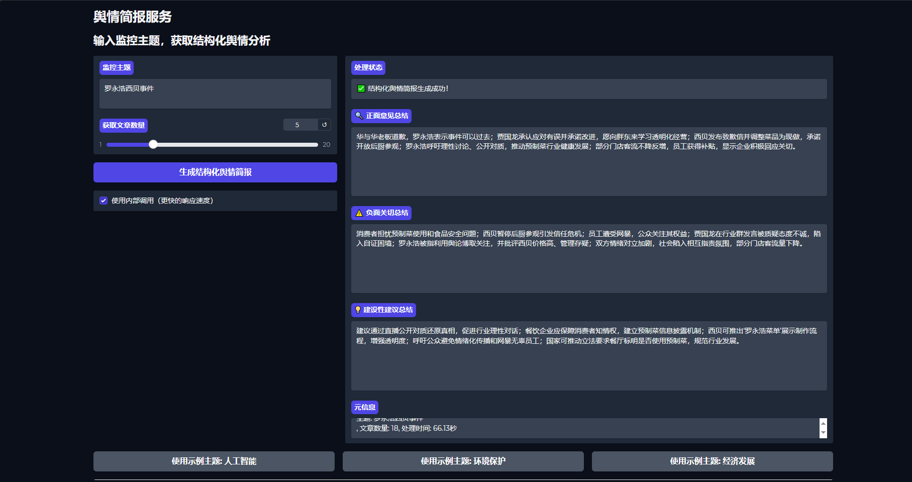

# 网络舆情简报生成服务

一个基于FastAPI和大语言模型的网络舆情简报生成系统，能够根据指定主题获取相关新闻文章，并生成结构化的舆情分析简报，包含正面意见、负面关切和建设性建议三个核心维度。系统提供RESTful API接口和基于Gradio的Web用户界面，支持Docker容器化部署。

## 项目架构



### 核心模块
- **API服务层**：基于FastAPI构建，提供RESTful API接口
- **核心业务层**：包含结构化简报生成、配置管理和数据模型
- **服务集成层**：集成新闻获取、大语言模型调用等服务
- **Web界面层**：基于Gradio构建的用户友好界面

## 功能特点

- 🔍 **智能内容分析**：根据用户指定主题获取相关新闻并进行深入分析
- 📊 **结构化简报生成**：提取并总结正面意见、负面关切和建设性建议
- 🌐 **双接口支持**：提供RESTful API和直观的Web用户界面
- 📦 **容器化部署**：支持Docker一键部署，便于在不同环境中运行
- 🚀 **高性能设计**：支持内部调用模式，提供更快的响应速度
- 🧪 **完善的测试**：包含单元测试，确保服务稳定性

## 目录结构

```
testProblem/
├── api/              # API接口定义和路由
├── core/             # 核心业务逻辑和模型
├── services/         # 各种服务实现（LLM、新闻、爬虫等）
├── web/              # Gradio Web用户界面
├── mock/             # 模拟数据
├── unitest/          # 单元测试
├── Dockerfile        # Docker构建文件
├── requirements.txt  # 项目依赖
└── start.sh          # 启动脚本
```

## 安装指南

### 本地开发环境设置

1. 确保已安装Python 3.10或更高版本

2. 克隆或下载项目代码

3. 安装项目依赖
```bash
cd /data/wangyihong/testProblem
pip install -r requirements.txt
```

4. 运行应用服务
```bash
# 启动API服务
uvicorn api.main:app --reload --port 8000

# 或启动Web界面
cd web
python app.py
```

### Docker容器化部署

1. 确保已安装Docker

2. 使用提供的启动脚本运行服务
```bash
cd /data/wangyihong/testProblem
sh start.sh
```

脚本将自动构建镜像并启动两个容器：
- `pos`：后端API服务
- `pos-ui`：Web用户界面服务（端口7866）

## API接口说明

### 1. 生成标准舆情简报

**请求URL**：`/generate_briefing`

**请求方法**：POST

**请求体**：
```json
{
  "topic": "要搜索的主题",
  "max_articles": 5  # 可选，默认获取5篇文章
}
```

**响应**：
```json
{
  "request_id": "请求ID",
  "topic": "请求的主题",
  "article_count": 获取到的文章数量,
  "summary": "生成的简报摘要",
  "processing_time": "处理时间"
}
```

### 2. 生成结构化舆情简报

**请求URL**：`/briefing/structured`

**请求方法**：POST

**请求体**：
```json
{
  "topic": "要搜索的主题",
  "max_articles": 5  # 可选，默认获取5篇文章
}
```

**响应**：
```json
{
  "request_id": "请求ID",
  "topic": "请求的主题",
  "article_count": 获取到的文章数量,
  "positive_opinion": "正面意见总结",
  "negative_concern": "负面关切总结",
  "constructive_suggestion": "建设性建议总结",
  "processing_time": "处理时间"
}
```

### 3. 健康检查

**请求URL**：`/`

**请求方法**：GET

**响应**：
```json
{
  "status": "ok",
  "message": "舆情简报服务正在运行"
}
```

## Web用户界面使用指南

系统提供了基于Gradio的直观Web用户界面，访问方式如下：

1. 启动Web服务（默认端口7866）
2. 在浏览器中访问 `http://localhost:7866`

### 使用步骤

1. 在"监控主题"输入框中输入您关心的主题关键词（例如："人工智能产业发展"）
2. 调整"获取文章数量"滑块（1-20篇）
3. 点击"生成结构化舆情简报"按钮
4. 系统将显示分析结果，包括：
   - 正面意见总结
   - 负面关切总结
   - 建设性建议总结
   - 处理状态和元信息

### 界面特点

- 支持内部调用模式，提供更快的响应速度
- 内置常用示例主题按钮（人工智能、环境保护、经济发展）
- 简洁明了的结果展示区域
- 实时处理状态反馈

## 使用示例

### 使用curl请求API

```bash
# 生成标准简报
curl -X POST http://localhost:8000/generate_briefing -H "Content-Type: application/json" -d '{"topic": "人工智能", "max_articles": 3}'

# 生成结构化简报
curl -X POST http://localhost:8000/briefing/structured -H "Content-Type: application/json" -d '{"topic": "环境保护", "max_articles": 5}'
```

### 使用Python请求API

```python
import requests

# 生成结构化简报示例
def generate_structured_briefing(topic, max_articles=5):
    url = "http://localhost:8000/briefing/structured"
    payload = {
        "topic": topic,
        "max_articles": max_articles
    }
    response = requests.post(url, json=payload)
    if response.status_code == 200:
        return response.json()
    else:
        return {"error": f"API调用失败: {response.text}"}

# 调用示例
result = generate_structured_briefing("经济发展", 7)
print(f"正面意见：{result.get('positive_opinion')}")
print(f"负面关切：{result.get('negative_concern')}")
print(f"建设性建议：{result.get('constructive_suggestion')}")
```

## 技术实现细节

- **核心流程**：获取新闻文章 → 结构化提取三个核心维度 → 生成总结
- **结构化分析**：系统通过大语言模型对每篇文章进行分析，提取以下维度：
  1. 首先判断新闻主旨是属于提出正面意见、负面关切或者是建设性建议
  2. 根据判断结果将内容分类到相应维度
  3. 对各个维度的内容进行总结和归纳
- **数据处理**：支持从模拟数据源获取文章（当前默认配置）
- **服务集成**：通过模块化设计实现服务间的松耦合集成

## 配置说明

- **Web界面配置**：web/app.py中的`base_url`配置API服务地址
- **端口配置**：API服务默认端口8000，Web界面默认端口7866
- **Docker配置**：通过start.sh脚本配置容器运行参数

## 开发说明

1. **项目结构**：遵循模块化设计，清晰分离API层、核心业务层和服务层
2. **依赖管理**：使用requirements.txt管理项目依赖
3. **日志记录**：实现了完善的日志系统，便于问题排查
4. **单元测试**：提供了全面的单元测试用例

## 注意事项

1. 当前版本使用模拟数据（mock_newsapi.json）进行测试，可根据需要配置真实数据源
2. 对于生产环境部署，建议调整Docker配置以提高安全性和性能
3. 处理大量文章时，响应时间可能会增加，请合理设置最大文章数量

## 合并请求描述
### 1. 项目初始化 (abd12e5 - Create testmain.py)
- 创建了基于 FastAPI 的 Web 服务框架
- 实现了 /generate_briefing API 端点，接收主题和最大文章数量参数
- 集成 NewsAPI 接口获取相关新闻文章
- 使用 transformers 库的 mT5-small 模型进行文本摘要生成
- 返回包含主题、文章数量和摘要的结果
### 2. 日志系统与异常处理 (6e8aa9f - add logger)
- 添加了完整的日志记录系统，记录各个处理阶段的详细信息
- 为每个请求生成唯一的 request_id，便于请求追踪
- 实现了全流程的异常捕获和处理机制
- 增加了性能监控，记录各阶段耗时
- 优化了 API 返回结果，增加了请求 ID 和处理时间字段
### 3. 模型优化与模拟数据 (9d7a191 - modify transformer && mock newsapi)
- 修改了 transformer 模型的加载方式，使用本地模型路径
- 添加了 mock_newsapi.json 模拟数据支持，便于测试和开发
- 移除了特定类型异常的单独处理，简化了异常处理逻辑
- 优化了错误提示信息
### 4. 单元测试与依赖管理 (3cf31f2 - add unitest && requirements upt)
- 添加了完整的单元测试用例，测试基本功能和错误处理链
- 使用 pytest 框架进行测试管理
- 添加了测试标记（如 @pytest.mark.slow）对测试进行分类
- 更新了项目依赖配置，确保所有依赖正确安装
### 5. 情感观点分析 (1cb6774 - extract positve nagtive and constructive)
- 增强了文本分析功能，能够从文章中提取正面观点、负面关切和建设性建议
- 重构了摘要生成逻辑，提升了分析的结构化程度
- 优化了模块导出机制，便于测试和其他模块调用
### 6. 数据存储与爬虫功能 (dc4eb9d - add sqllite db && spider)
- 添加了 SQLite 数据库支持，用于存储爬取的文章和分析结果
- 实现了网络爬虫服务，能够从多个来源爬取网页内容
- 添加了爬虫服务测试功能，验证爬虫的有效性和稳定性
- 完善了爬虫的错误处理和日志记录
### 7. Web 用户界面 (5d146c5 - add webui)
- 添加了基于 Gradio 的可视化 Web 用户界面
- 提供了主题输入、文章数量调整和内部调用选项
- 增加了示例主题按钮（人工智能、环境保护、经济发展）
- 完善了界面布局和使用说明
- 配置了服务参数（监听地址、端口等）